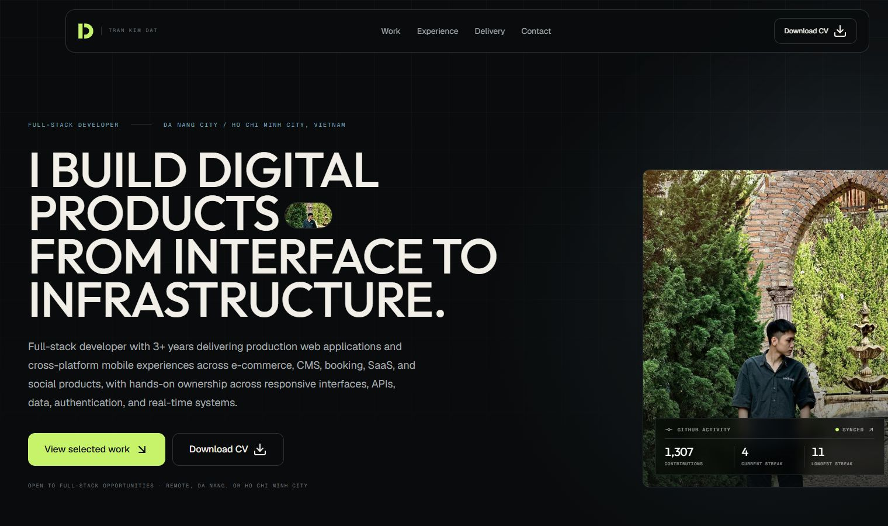
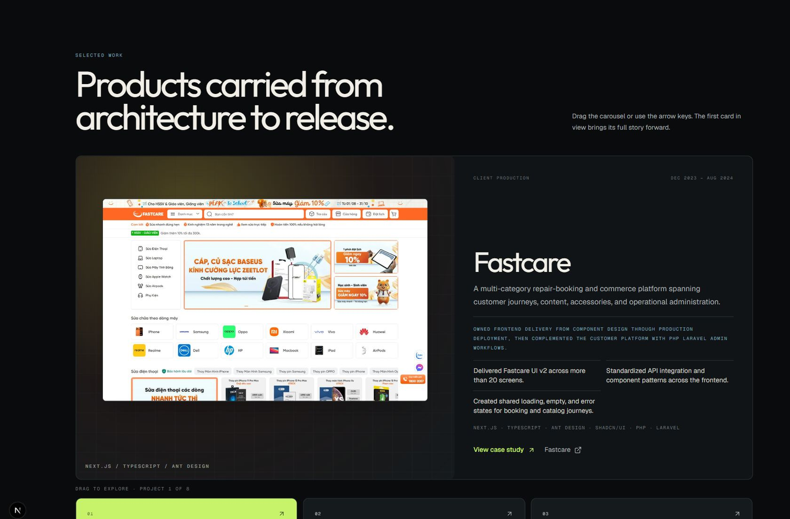
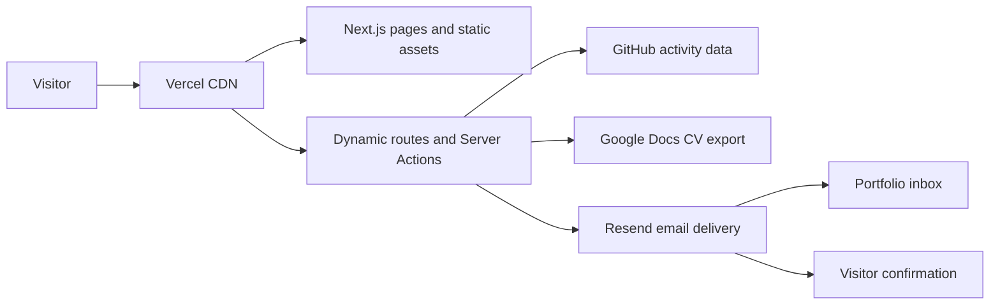

# Tran Kim Dat — Full-stack Developer Portfolio

[View the live portfolio](https://www.dattk.dev) · [Download the latest CV](https://www.dattk.dev/api/cv) · [LinkedIn](https://www.linkedin.com/in/kimdat0705/) · [GitHub](https://github.com/dattk2002)



## About this project

This is my personal full-stack portfolio: an editorial, responsive product experience built to show not only what I shipped, but also what I owned across interface design, application architecture, APIs, data, testing, containerization, and production delivery.

The site is organized around real project evidence. Each selected work item connects its product context, my responsibilities, measurable outcomes, technology choices, live deployments, and source repositories. The interface is intentionally interactive while remaining keyboard-accessible and respectful of reduced-motion preferences.

## What I built

- **Responsive editorial interface** — a custom dark visual system with fluid typography, asymmetric layouts, optimized WebP artwork, and layouts designed for phone, tablet, and desktop breakpoints.
- **Data-driven project portfolio** — eight projects share typed content models and statically generated case-study routes, keeping project details consistent across the homepage, experience timeline, and detail pages.
- **Gesture-based exploration** — the Selected Work carousel supports touch dragging, mouse dragging, card selection, and arrow-key navigation. The featured project surface can also be swiped directly on mobile.
- **Interactive professional timeline** — expandable project details, drag-to-scroll behavior, inertial movement, and automatic positioning expose deeper experience without turning the page into a long static résumé.
- **Live GitHub activity** — a server endpoint calculates contribution totals and streaks in the Asia/Bangkok timezone, with bounded requests, graceful failure states, and CDN-friendly caching.
- **Two-way contact workflow** — a validated server action sends the enquiry to me and a confirmation to the visitor through Resend. It includes Zod validation, subject sanitization, a honeypot, reply routing, and optional Upstash rate limiting.
- **Always-current CV delivery** — `/api/cv` exports the source Google Doc as PDF and uses a local PDF as a fallback, so the download can stay current without rebuilding the portfolio for every CV edit.
- **Search and sharing support** — canonical metadata, generated Open Graph artwork, `robots.txt`, and a project-aware sitemap are produced through Next.js conventions.

## Selected work experience



The portfolio currently documents work across Flutter, ASP.NET Core, NestJS, Next.js, React, Laravel, PostgreSQL, MongoDB, SignalR, Docker, and CMS-backed production systems. Project content lives in `lib/projects.ts`, while professional history and delivery evidence are maintained separately in `lib/experience.ts` and `lib/capabilities.ts`.

## How the portfolio works



The App Router keeps content-heavy pages statically generated where possible. Dynamic work is isolated behind server routes and Server Actions, so API credentials never need to enter the browser bundle.

## Production, domain, and Vercel CDN

The production deployment is available through the custom domain [`dattk.dev`](https://dattk.dev), which resolves to the canonical [`www.dattk.dev`](https://www.dattk.dev) deployment on Vercel.

Vercel places every deployment behind its global CDN. For this portfolio, that means:

- static pages, images, fonts, and framework assets can be delivered close to visitors;
- routing, compression, cache behavior, and deployment aliases are handled by the platform;
- dynamic endpoints such as GitHub statistics and CV delivery remain server-side while using explicit cache policies;
- the verified custom domain receives managed HTTPS and automatic SSL certificate provisioning;
- a production deployment can be replaced atomically without changing the public domain.

The CDN is not described here as a blanket cache for every request: static output is cacheable, while contact submissions and other dynamic behavior still execute securely on the server. See the official [Vercel CDN overview](https://vercel.com/docs/cdn) and [custom domain guide](https://vercel.com/docs/domains/set-up-custom-domain) for the platform behavior behind this deployment.

## Technology

| Area | Implementation |
| --- | --- |
| Framework | Next.js 16 App Router, React, TypeScript |
| Styling | Tailwind CSS, shadcn/ui conventions, Geist and Outfit |
| Motion | Framer Motion, Embla Carousel, Embla Auto Scroll |
| Forms and email | React Server Actions, Zod, Resend |
| Content | Typed TypeScript data, Google Docs CV export |
| Media and SEO | `next/image`, generated Open Graph images, sitemap, robots |
| Hosting | Vercel production deployment, custom domain, Vercel CDN |
| Runtime | Node.js 24.x, Yarn 4.9.2 |

## Local development

```bash
corepack yarn install
Copy-Item .env.example .env.local
corepack yarn dev
```

Open `http://localhost:3000`.

### Environment variables

| Variable | Purpose | Exposure |
| --- | --- | --- |
| `NEXT_PUBLIC_SITE_URL` | Canonical origin used for metadata, sitemap, robots, and Open Graph URLs | Public config |
| `RESEND_API_KEY` | Authenticates server-side Resend requests | Secret, server only |
| `RESEND_FROM_EMAIL` | Verified sender, currently `Portfolio <contact@dattk.dev>` | Server config |
| `CONTACT_TO_EMAIL` | Destination for portfolio enquiries | Server config |
| `UPSTASH_REDIS_REST_URL` | Optional contact rate-limit backend | Server config |
| `UPSTASH_REDIS_REST_TOKEN` | Optional Upstash credential | Secret, server only |

For production, set `NEXT_PUBLIC_SITE_URL=https://www.dattk.dev`. Keep real credentials in `.env.local` and Vercel Environment Variables; never commit them.

## Quality checks

```bash
corepack yarn typecheck
corepack yarn lint
corepack yarn build
```

## Main routes

- `/` — portfolio home and project overview
- `/projects/[slug]` — statically generated project case studies
- `/api/cv` — current CV exported as PDF
- `/api/github-stats` — cached contribution and streak summary
- `/opengraph-image` — generated social sharing image
- `/sitemap.xml` and `/robots.txt` — search-engine discovery

## Project structure

```text
app/                  App Router pages, metadata, Server Actions, and API routes
components/           Interface, navigation, motion, carousel, and form components
lib/                  Typed project, experience, capability, and site content
public/images/        Optimized portraits, project artwork, and README screenshots
public/documents/     Static CV fallback
```

## Deployment

1. Import the repository into Vercel with the project root unchanged.
2. Use the Next.js framework preset, Yarn package manager, and Node.js `24.x`.
3. Add the variables documented in `.env.example` to the appropriate Production, Preview, and Development environments.
4. Keep `RESEND_API_KEY` sensitive and server-only. `NEXT_PUBLIC_SITE_URL` is intentionally public configuration.
5. Verify `dattk.dev` in Resend and use a sending-only API key restricted to that domain.
6. Deploy, then verify the canonical domain, CV download, project routes, GitHub activity, and both contact emails.

No cookie banner is required unless analytics, advertising, or other non-essential tracking is added later.
